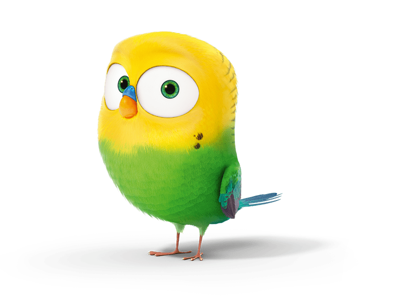

<h1>

𝔹𝕌𝔻𝔾𝔼𝕋 𝔹𝕌𝔻𝔾𝕀𝔼

</h1>

*__Budget Budgie__ is a personal "pet" project to customise handling of household budget in an effective way.*

*Feel free to use it, but be aware that it also servers as a way to learn coding and therefore some features might end up sacrificing the best, fastest solutions in favor of trying out multiple/new approaches/proofs of concept.*

*Budgie has also been documenting my "junior software dev to be" learning curve for over a year and I am aware of some bad naming, architectural decisions and other almost-legacy-code I could do better now that I simply didn't have time to refactor yet. It might take time before I get to fixing bugs that don't "bug me that much" (pun intended) in my free time.*

***

## 𝕓𝕦𝕚𝕝𝕕 𝕨𝕚𝕥𝕙

- [React.js](https://reactjs.org/) + [TypeScript](https://www.typescriptlang.org/)
- [Firebase](https://firebase.google.com/) (Auth & Firestore DB)
- [Netlify](https://www.netlify.com/) (hosting)

***

## 𝕡𝕣𝕖𝕣𝕖𝕢𝕦𝕚𝕤𝕚𝕥𝕖𝕤

- [Git](https://git-scm.com/)
- [Node.js](https://nodejs.org/en/download/)
- [Yarn](https://classic.yarnpkg.com/en/docs/getting-started)

***

## 𝕚𝕟𝕤𝕥𝕒𝕝𝕝𝕒𝕥𝕚𝕠𝕟

1. type `yarn` to install dependencies
2. create local `.env.development` file and fill it with correct envinronment variables that can be found in `Firebase console > Project settings` (or ask for them)
3. type `yarn start` to open [http://localhost:3000](http://localhost:3000) and view project in the browser

***

## 𝕒𝕧𝕒𝕚𝕝𝕒𝕓𝕝𝕖 𝕤𝕔𝕣𝕚𝕡𝕥𝕤

In the project directory, you can run:
- yarn `start` (opens localhost)
- yarn `format` (formats with Prettier)
- yarn `lint` (lints with ESLint)
- yarn `lint:css` (lints with StyleLint)